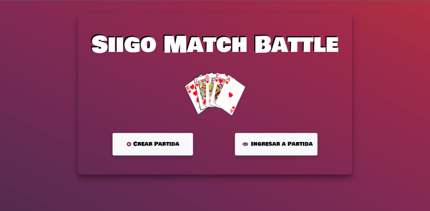
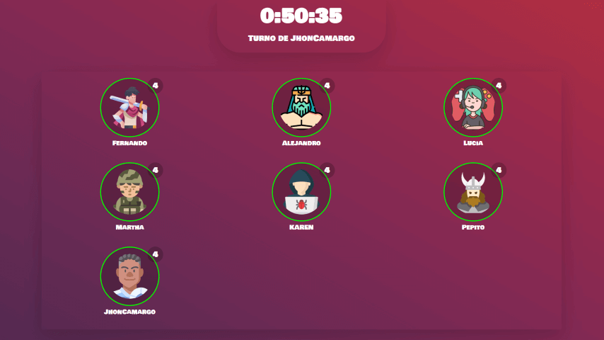

# SIIGO MATCH BATTLE 

## OBJETIVO DEL JUEGO
Acumular el mayor n&#250;mero de cartas mediante la comparaci&#243;n de diferentes caracter&#237;sticas
de los modelos.

### Descripción
Juego de cartas para jugar de manera simult&#225;nea. El tema del juego son los computadores y sus caracter&#237;sticas.
Este juego se est&#225; desarrollando en lenguaje Java.

## Diagrama de casos de uso

## Diagrama de clases

## Mockups

